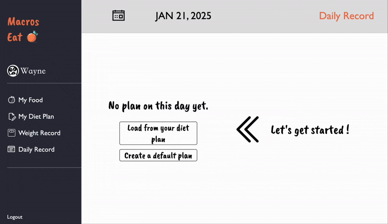
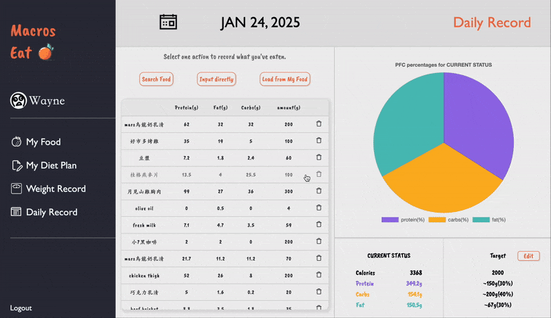
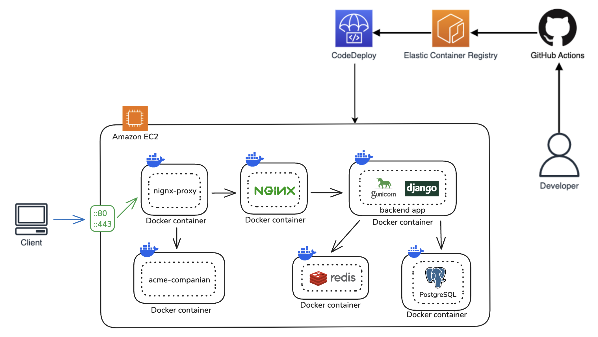
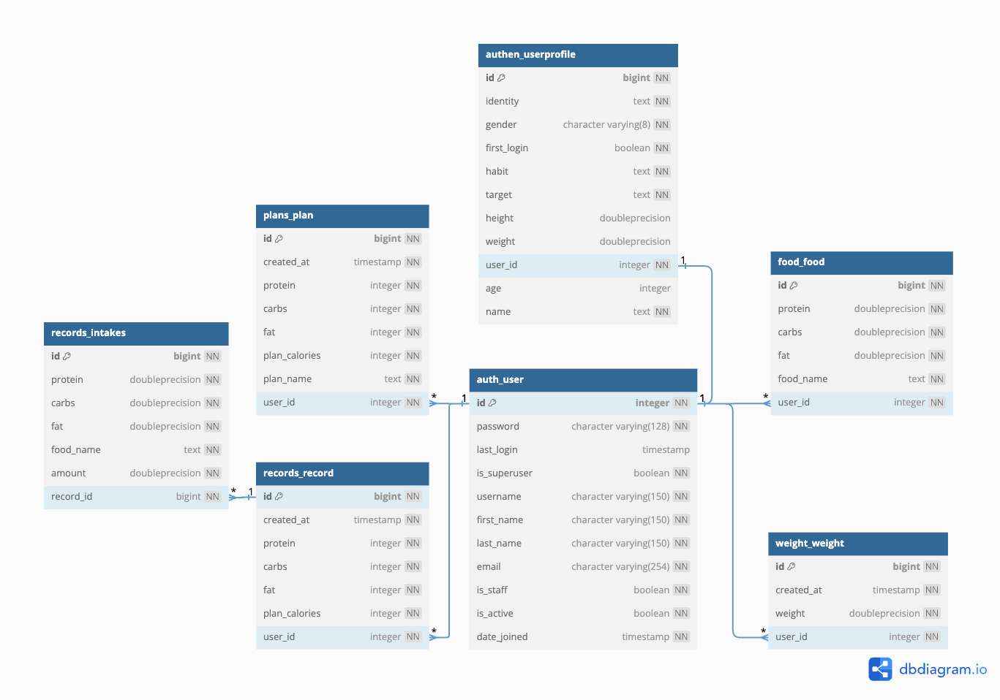

# Macros Eat

  

Macros Eat aims to help you record your daily diet with personalized diet plans focusing on macronutrients.

🖥️ Website URL : https://www.macroseat.online/

Test account : test@gmail.com

Test password : 123

## Demo
- Select a day to load in your diet plan and starts to manage your food, diet plan and diet record.

- Record weight for every day, choose a date range to display your weight record.

## Table of Contents

- [Main Features](#main-features)
- [Backend Technique](#backend-technique)
  - [Deployment](#deployment)
  - [Language / Web Framework](#language--web-framework)
  - [WSGI Server](#wsgi-server)
  - [AWS Cloud Service](#aws-cloud-service)
  - [Database](#database)
  - [Networking](networking)
  - [Third Party Library](#third-party-library)
  - [Version Control](#version-control)
- [Architecture](#architecture)
  - [Server Architecture](#server-architecture)
- [Database Schema](#database-schema)
- [Frontend Technique](#frontend-technique)
- [Contact](#contact)

## Main Features

- Setup CI/CD pipeline with github action and AWS Elastic Container Register / CodeDeploy.
- Memebr System
  - User can sign in locally.
  - User authentication with session based cookie.
- Diet Record Features
  - User can customize personalized food and diet plans based on individual needs.
  - Supports searching for all food existing in this website. (implemented with PostgreSQL GIN index)
  - Visualize macronutrients consuming status.
  - Supports recording daily weight.

## Backend Technique

#### Deployment
- Auto deployment with Github actions workflow
- Containerize
- docker-compose

#### Language / Web Framework
- Python3.13 / Django

#### WSGI Server
- Gunicorn

#### AWS Cloud Service
- EC2
- Elastic IP
- Elastic Container Registry
- CodeDeploy

#### Database
- PostgreSQL
- Redis

#### Networking
- HTTP & HTTPS
- Domain Name System (DNS)
- NGINX
- SSL (Let's Encrypt)

#### Third Party Library
- Django REST framework

#### Version Control
- Git/GitHub

## Architecture

#### Server Architecture

  

## Database Schema

  

## Frontend Technique

- HTML
- JavaScript
- CSS
- AJAX
- Third Party Library
  - chart.js
  - moment.js
  - lodash

## Contact

👨🏻‍💻 許哲瑋 Che Wei Hsu

📬 Email : whph60308@gmail.com
